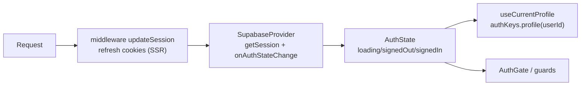

# Authentication feature (architecture)

Production-grade Next.js architecture for the Authentication feature, derived
from a full study of the Flutter auth implementation (`lib/global/signin_signup_page.dart`,
`auth_state_page.dart`, `profile_page.dart`, `lib/providers/supabase/` auth
methods, `lib/models/profile.dart`) AND the Supabase auth already wired into
this Next.js project (`SupabaseProvider`/`useSupabase`, `lib/supabase/{client,
server,config,middleware}`, the shared `ProfileService`/`UploadService`).
**Implementation status**: the full feature is implemented — types, constants,
utils (deep link + validation), services (the `AuthService` + the shared
`ProfileService.updateProfile` extension), React Query (3 queries + 11
mutations), behavior hooks (6) and the complete UI (forms, profile, gates,
pages, routes + the middleware guards). The only contract-only folder is
`store/` (the Zustand `useAuthFormStore` was NOT built — the UI forms own
their transient state locally; per the user's instruction a store is only
created if a real shared UI state is discovered, and none was).

## The ONE authentication source

The session ALREADY lives in the existing `SupabaseProvider`
(`useSupabase().session`), which calls `auth.getSession()` on mount and
subscribes to `auth.onAuthStateChange`; `lib/supabase/middleware.ts` refreshes
the session cookies on every request (there is a `TODO(features/auth)` for the
route guards). **The auth feature does NOT create a second session source** —
it derives `AuthState` from the provider and adds the auth *service* (the
`auth.*` client methods + the auth RPCs), the flows, the profile editing
(reusing the shared `ProfileService`) and the protected-route guards.

## Folder responsibilities

| Folder | Responsibility |
| --- | --- |
| `types/` | `AuthState`/`AuthStatus`, `AuthSession`/`AuthUser`/`UserProfile` (aliases over Supabase + shared `Profile`), `AuthProviderId`, `AuthDeepLink`, `SignupStatus`. **Implemented.** |
| `constants/` | Validation + flow tuning (password/phone/name/OTP/avatar/OAuth redirects). **Implemented.** |
| `queries/` | Cache-key hierarchy (`authKeys`) + the queries (`useAuthState`/`useCurrentUser`/`useProfile`) + the mutations (all 11). **Implemented.** |
| `services/` | `AuthService` (feature-local, all 13 methods) + the shared `ProfileService` extension (`updateProfile`) + shared `UploadService` (avatar). **Implemented.** |
| `utils/` | `buildAuthUrl`/`parseAuthPath` (deep link) + `isValidEmail`/`isValidPassword`/`isValidName`/`isValidNepalPhone`/`formatNepalPhone`/`getAuthErrorMessage` (validation). **Implemented.** |
| `store/` | `useAuthFormStore` (NON-persisted) + explicit "no session/profile store" decisions. Contract only (`README.md`) — NOT built: the UI forms hold their field state locally (no real shared UI state was discovered). |
| `hooks/` | `useAuth`, `useAuthActions`, `useAuthNavigation`, `useProfileEditor`, `useProtectedRoute`, `useAdminRoute`. **Implemented.** |
| `components/` | `SignInForm`, `SignUpForm`, `SocialSignInButton`, `ForgotPasswordForm`, `ResetPasswordForm`, `ProfileForm`/`ProfileAvatar`, `AuthGate`/`AdminGate`, `DeleteAccountDialog` + the page orchestrators (`SignInPage`/`SignUpPage`/`ForgotPasswordPage`/`ResetPasswordPage`/`ProfilePage`/`AuthCallbackPage` + `AuthRouteDispatcher`). **Implemented.** |
| `README.md` | This document. |

## Full Flutter → Next mapping

### Pages

| Flutter | Web page (planned) | Route | Key behavior |
| --- | --- | --- | --- |
| `SignInSignUpPage` (login mode) | `SignInPage` | `/sign-in` | email/password + Google (Supabase OAuth) + "Forgot password?" |
| `SignInSignUpPage` (sign-up + OTP mode) | `SignUpPage` | `/sign-up` | name/phone/email/password → OTP verify (the `_showOtpField` step, split into its own flow state) |
| — (Flutter's reset email is COMMENTED OUT) | `ForgotPasswordPage` / `ResetPasswordPage` | `/forgot-password` / `/reset-password` | **WEB-FIRST** password-recovery flows (`resetPasswordForEmail` + `updatePassword`) |
| `ProfilePage` (`profile_page.dart`) | `ProfilePage` | `/profile` (protected) | avatar upload (shared `UploadService`), name/phone edit (shared `ProfileService.updateProfile`), sign out, delete account (RPC) |
| `AuthStatePage` (`auth_state_page.dart`) | `AuthGate` | wraps protected surfaces | signed-out → sign-in (the web uses middleware + `AuthGate` instead of the Flutter route wrapper) |
| — | `AuthCallbackPage` | `/auth/callback` | the Supabase OAuth + password-recovery redirect target (loading state → `?next=`/`/profile`) |

### Repository → service

| Flutter repository method | Planned service method |
| --- | --- |
| `signIn` / `signUp` / `signOut` / `signInWithGoogle` | `AuthService.signIn` / `signUp` / `signOut` / `signInWithGoogle` |
| `resendVerificationEmail` / `verifySignupOtp` / `getSignupStatus` | `AuthService.resendVerificationEmail` / `verifySignupOtp` / `getSignupStatus` |
| `updatePassword` / (`sendPasswordResetEmail` commented out) | `AuthService.updatePassword` / `resetPasswordForEmail` (web-first) |
| `markEmailVerified` / `deleteMyAccount` | `AuthService.markEmailVerified` / `deleteMyAccount` (RPC) |
| `fetchProfileById` / `updateProfile` | shared `ProfileService.getProfileById` / **`updateProfile` (extended)** |
| `_uploadAvatar` (avatars bucket) | shared `UploadService.uploadFile`/`deleteFile` (`avatars/{userId}-avatar.{ext}`) |

### Providers / notifiers → queries + store

| Flutter provider | Planned React Query hook | Planned Zustand store |
| --- | --- | --- |
| `authStateProvider` (StreamProvider) | `useAuthState` (derives from `useSupabase()`) | — (the provider owns the session) |
| `currentUserProvider` / `profileStream` | `useCurrentProfile` (`authKeys.profile`) | — (React Query cache) |
| `getSignupStatus` | `useSignupStatus` (`authKeys.signupStatus`) | — |
| `_SignInSignUpPageState` controllers | — | `useAuthFormStore` (NON-persisted) |

### Models

| Flutter model | React type | Source |
| --- | --- | --- |
| `Profile` | `UserProfile` | alias of the SHARED `@/types/profile.Profile` (no duplicate) |
| `AuthState` (supabase_flutter) | `AuthState` | derived domain state (provider session + profile query) |
| `Session`/`User` | `AuthSession`/`AuthUser` | aliases over `@supabase/supabase-js` (the provider owns them) |
| — | `AuthProviderId` | `"email" \| "google"` |
| — | `AuthDeepLink` | the auth route union (deep-link model) |
| `getSignupStatus` result | `SignupStatus` | `"new" \| "unverified" \| "verified"` |

## Authentication flows

- **Sign In** — email/password → `getSignupStatus`; if `unverified` → resend
  the verification email + OTP step; else `signInWithPassword` → provider
  session → redirect to `?next=`/`/profile`.
- **Sign Up** — name/phone/email/password → `getSignupStatus`: `verified` →
  switch to sign-in; `unverified` → resend + OTP; `new` → `signUp` + OTP. The
  OTP step verifies via `verifyOtp({type:"signup"})` + `markEmailVerified`.
  NOTE: this phase's UI (`SignUpForm`) submits via `useAuthActions.signUp` and
  shows a "check your email" success state — the OTP mutations/panel are NOT
  built (not requested); the `AuthService` OTP methods exist for a later step.
- **Sign Out** — `auth.signOut()` → provider session null → `AuthGate`
  redirects.
- **Forgot Password** — `resetPasswordForEmail(email, { redirectTo:
  "/reset-password" })` (WEB-FIRST; Flutter's is commented out).
- **Reset Password** — the recovery link lands on `/reset-password`; the hash
  (`type=recovery` + `access_token`) is read client-side, then
  `updatePassword(password)` via `auth.updateUser`.
- **Email Verification** — the OTP-based `verifySignupOtp` flow (not a separate
  confirmation-link page; faithful to Flutter).
- **Google Sign In** — Supabase OAuth (`signInWithOAuth({ provider: "google" })`)
  redirecting to `/auth/callback`. NOT Firebase (see below).
- **Session Restore** — provider `getSession()` + middleware cookie refresh +
  `onAuthStateChange`; profile refetches when the session userId changes.
- **Profile** — `useProfile`: avatar (shared `UploadService`), name/phone
  (shared `ProfileService.updateProfile`), sign out, delete account (RPC).

## Session lifecycle

1. Every request: middleware refreshes the session cookies (SSR).
2. On mount: provider `getSession()` → `isLoaded`; `onAuthStateChange`
   subscribes for sign-in/out/refresh/token changes (the single source).
3. `AuthState` derives from the provider (`status/session/user`) + the profile
   query.
4. Sign-out → session null → profile query disabled → guards redirect.

## Google OAuth flow (Supabase, not Firebase)

Flutter uses the NATIVE GoogleSignIn SDK + `signInWithIdToken`. On the web the
equivalent is **Supabase's OAuth** (the user's explicit requirement — no
Firebase): `auth.signInWithOAuth({ provider: "google", options: { redirectTo:
origin + "/auth/callback" } })` → Google → back to `/auth/callback`, where the
Supabase SSR PKCE flow completes and `onAuthStateChange` sets the provider
session. The callback page is a loading state that forwards to `?next=`/`/profile`.

## Protected-route strategy

- **Server**: `lib/supabase/middleware.ts` (the `TODO(features/auth)`) guards
  `/profile` → `/sign-in?next=` when signed out; away-redirects signed-in users
  from the auth pages; admin routes check the profile `role` via the server
  client (`from("profiles").select("role")`) → redirect when not admin/editor.
- **Client**: `AuthGate` reads `useAuthState()` (loading until `isLoaded`,
  redirect on signed-out, `?next=` preservation); `AdminGate` uses the shared
  `canManage` rule (the Songs/Articles gates already use it).

## Reuse (nothing duplicated)

- **Profile**: the shared `@/types/profile.Profile` + `ProfileService` (+ the
  implemented `updateProfile` extension) — one `profiles`-table gateway.
- **Upload**: avatar upload/delete via the shared `UploadService`.
- **Layout/UI**: the shared `AuthLayout`, `Input`/`Button`/`Label`, the shared
  states, `ConfirmDialog`/`useDialog`.
- **Session**: the existing `SupabaseProvider` — one auth source.

## Verify

- **No duplicated architecture**: every Flutter piece maps 1:1; the shared
  `Profile`/`ProfileService`/`UploadService`/`AuthLayout` are reused, not
  copied; the session is single-sourced in the provider.
- **One authentication source**: the provider's session + `onAuthStateChange`
  (no session store, no duplicate session state).
- **Profile reuses the existing `profiles` table** via the shared service.
- **Google OAuth uses Supabase** (`signInWithOAuth`), not Firebase.

## Scope (implemented layers)

Built across phases: `types/`, `constants/`, `utils/` (deep link + validation),
`services/` (the `AuthService` + `AuthServices` factory + the SHARED
`ProfileService.updateProfile` extension), `queries/` (React Query:
`useAuthState`/`useCurrentUser`/`useProfile` + all 11 mutations), `hooks/`
(behavior: `useAuth`, `useAuthActions`, `useAuthNavigation`, `useProfileEditor`,
`useProtectedRoute`, `useAdminRoute`) and the full UI (`components/`: forms,
profile, `AuthGate`/`AdminGate`, pages, `AuthRouteDispatcher` + the six routes
`/sign-in` `/sign-up` `/forgot-password` `/reset-password` `/profile`
`/auth/callback` + the middleware route guards in `lib/supabase/middleware.ts`).
**Not built** (per instructions): the Zustand `useAuthFormStore` (no real shared
UI state was discovered — the forms own their transient field state) and the
sign-up OTP step (its mutations were not requested). No backend schema/APIs
invented.

Verified (UI phase): one auth source (the `SupabaseProvider` session — derived,
never duplicated), no direct Supabase in components/pages (all via the existing
hooks/React Query layer), no duplicated session/profile/upload/auth logic,
Google OAuth via Supabase (browser-verified: the button initiates
`signInWithOAuth` through `api.sgmbiblezone.com/auth/v1/callback`), lint +
build PASS, validation utils smoke 30/30, browser-verified (see
`components/README.md`): all 6 routes render, sign-in/sign-up/forgot validators
mirror Flutter, email-sign-in error surfaces inline, `/profile` + `/admin`
middleware redirects to `/sign-in?next=…`, `/auth/callback` loading state,
show/hide password toggle. Signed-in happy paths (profile update, avatar
upload, sign out, delete) are wired through `useProfileEditor`/the shared
services and lint/build-clean — no test account exists (SMTP unconfigured).
